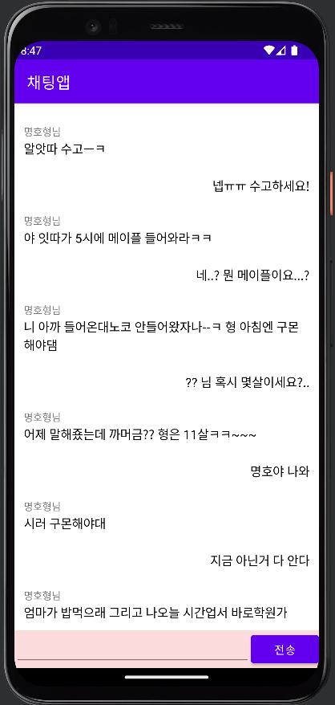
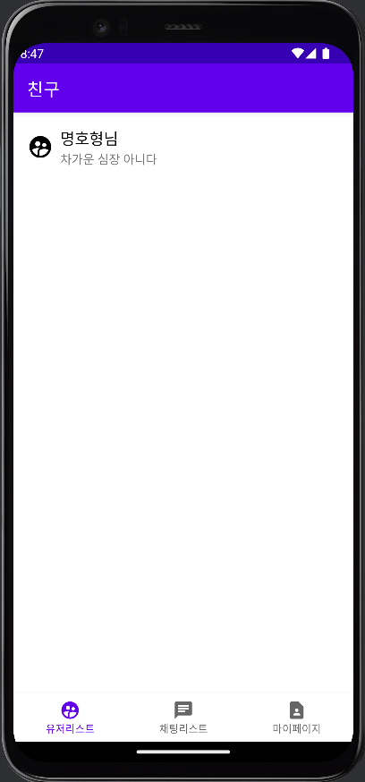
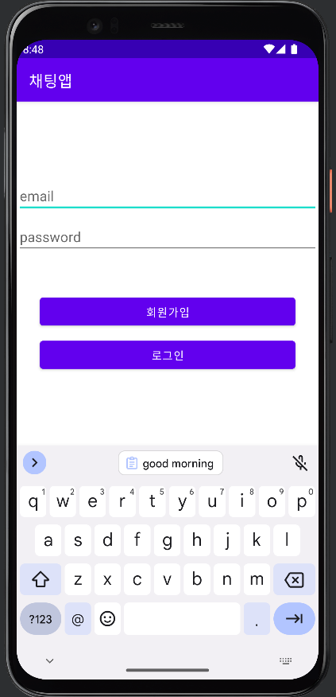

# 채팅앱 (part2-chapter6)

## 이 챕터를 통해 배우는 것

1. Firebase Realtime Database
2. Firebase Authentication
3. Firebase Cloude Message (일명 FCM)

### Firebase

[Firebase](https://firebase.google.com/)

구글에서 만든 모바일 및 애플리케이션 개발 플랫폼, 다양한 플랫폼을 지원합니다. 

(Android, iOS 뿐만 아니라, Web, Flutter, C++, 게임, 서버, 기타등등)

파이어베이스? 개발 플랫폼??

애플리케이션 개발자가 더 나은 애플리케이션을 개발할 수 있도록 도와주는 개발 플랫폼

- 빌드 (개발과정, 더 빠르게 시장에 진출하고 사용자에게 가치를 전달)
    - 서버 관리 없이 백엔드 가동
    - 일반적인 앱 개발 문제를 쉽게 해결
    - 손쉽게 확장하여 수백만명의 사용자를 지원
        - Cloude Firestore (클라우드에 데이터 저장, 동기화, 명시적인 쿼리 작성, 서버리스 앱 빌드)
        - **Realtime Database (실시간 동기화 JSON 데이터를 저장하는 DB, (서버리스 앱 빌드))**
        - Remote Config (동작 제어)
        - Cloude Functions (서버 (를 따로 관리 안할 수 있도록 파이어베이스에서 서버 로직을 작성, 실행))
        - **Cloude Messaging (푸시 메시지)**
        - Cloude Storage (사진 및 동영상 저장)
        - Firebase ML (머신러닝)
        - 등등
- 출시 및 모니터링 (짧은 시간에 훨씬 수월하게 앱 품질을 향상)
    - 테스트, 분류, 문제 해결 프로세스 간소화
    - 기능을 신중하게 출시하고 도입을 모니터링하세요.
    - 문제를 조기에 정확하게 파악하여 우선순위를 정하고 안정성 및 성능 문제를 해결
        - Google Analytics
        - Remote Config
        - Performance Monitoring
        - Test Lab
        - App Distribution
- 참여 (앱 경험 최적화 및 고객 만족도 유지)
    - 사용자를 파악하여 더 효과적으로 지원하고, 사용자층을 유지
    - 실험을 실행하여 아이디어를 테스트하고 새롭고 유용한 정보를 파악
    - 다양한 세그먼트에 맞게 앱을 맞춤 설정
        - Remote Config
        - Google Analytics
        - A/B Testing
        - **Authentication**
        - **Cloud** **Messaging**
        - Crashlytics
        - Dynamic Links
        - In-App Messaging